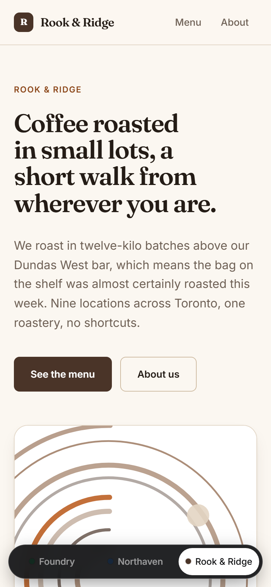
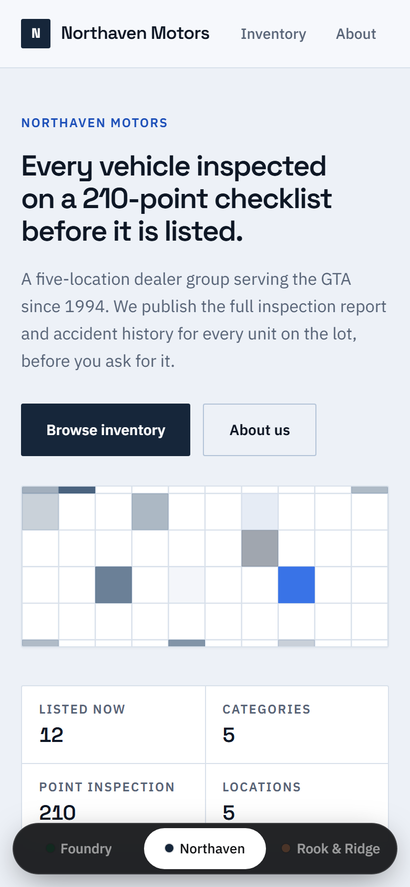
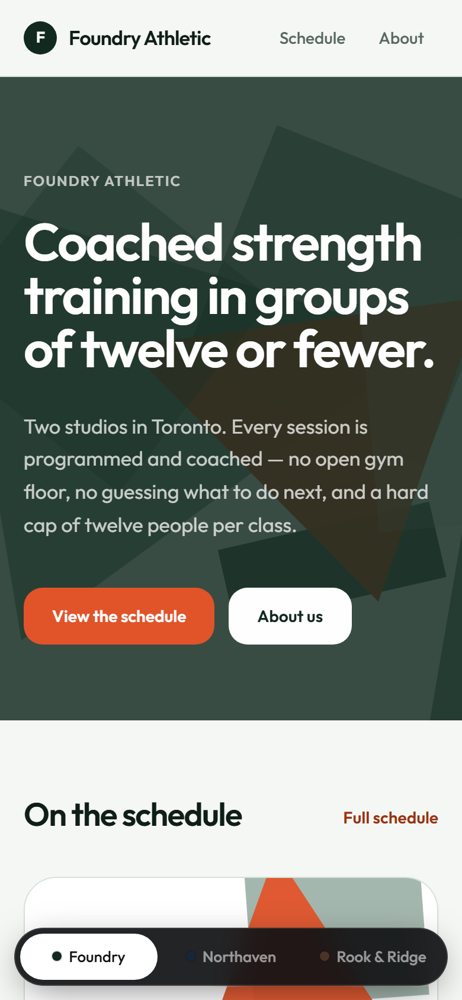

# Chameleon

**One codebase, many branded consumer front-ends.** Theme, content, routing and data are resolved per request from Postgres, so launching a new client brand is a database row rather than a fork of the codebase.

- **Live demo:** https://chameleon-gray.vercel.app
- **Source:** https://github.com/adilet0212/chameleon

Three storefronts run on this deployment — a coffee roaster, an automotive dealer, and a fitness studio. They have different colours, typefaces, corner radii, imagery treatments, navigation labels and URL structures, and there is no per-brand code anywhere in the repository. All three brands are fictional; no real company's marks or assets appear here.

|  |  |  |
| :---: | :---: | :---: |
|  |  |  |
| Rook & Ridge | Northaven Motors | Foundry Athletic |

---

## The problem this is built around

An agency that ships branded consumer experiences for many clients out of one team has a specific structural problem: every new client wants a distinct-feeling product, and the obvious way to give them one is to fork the codebase. Do that eight times and you have eight codebases, eight dependency upgrade paths, and eight places to fix the same bug.

The alternative is to make brand identity *data*. That is what this project is: a single application where everything that distinguishes one client from another lives in Postgres, and the code has no idea which brand it is rendering.

The interesting engineering is not "can you build a storefront." It is keeping brands genuinely isolated while sharing one component tree, and keeping the data access fast when it is all keyed on tenant.

## How it works

### Tenant resolution

Two addressing schemes resolve to one route tree:

```
rook-and-ridge.example.com/menu   ->  /rook-and-ridge/menu   (subdomain)
example.com/rook-and-ridge/menu   ->  /rook-and-ridge/menu   (path segment)
```

`src/middleware.ts` folds the subdomain form into the path form with a rewrite. Duplicating routes per addressing scheme is exactly how a multi-tenant codebase starts forking, so there is one set of routes and middleware normalises into it.

Middleware deliberately does **not** touch the database. It runs on every request, and opening a connection there would put a query in front of every asset. It resolves the *identifier* only; the tenant record is loaded in the server component that needs it, where React's `cache()` dedupes it to a single query per request. An unknown slug falls through to `notFound()`.

### Theming

Each tenant owns a row of design tokens — a five-colour palette plus three surface tints, a typeface pairing, a radius, display letter-spacing, a brand-tinted shadow, and an imagery language. The tenant layout resolves the tenant once and writes those tokens onto a single wrapper element as CSS custom properties:

```tsx
<div id="tenant-scope" style={themeToCssVars(tenant.theme)}>
```

Tailwind v4's `@theme inline` maps its utilities onto those properties, so every component underneath styles itself from the tokens without knowing which brand it is rendering. There is no per-brand stylesheet, no class-name switch, and no conditional keyed on tenant slug anywhere in the component tree.

The structural design decisions — spacing rhythm, type scale, line lengths, focus treatment — are shared and fixed. That is deliberate, and it is why three different brands still look like they came out of the same studio rather than three different template purchases.

### Composition is a token too

Colour alone does not make two storefronts feel like different brands. If every client gets the same skeleton with a new palette, it reads as a theme switcher rather than a platform — so `tenant.layoutVariant` selects between three arrangements:

| Variant | Hero | Featured | Catalogue grid |
| --- | --- | --- | --- |
| `editorial` | Split, generous measure | One large lead card + compact supporting pair | 3-across |
| `dense` | Compact, with a spec strip | Four across, tight gutters | 4-across |
| `showcase` | Full-bleed, dark, artwork overlay | Asymmetric — one tall beside a stacked pair | 3-across |

They also differ in card aspect ratios, category presentation, and the sequence of surface tints down the page. What they share is the spacing scale, the type ramp, focus states, and the card component itself — none of them ships its own card or its own button, and none is keyed on a brand name. A fourth arrangement is a branch in `HomeLayouts.tsx` plus a string in a row.

### Catalogue data vs. benchmark data

The products table holds 15,036 rows so the index benchmark has something real to measure, but only the 36 hand-written entries are merchandising. `isCatalogueVisible` separates "exists in the table" from "shown to a visitor": every user-facing query filters on it — including the category counts, since a catalogue reading *Espresso 1,003* beside six real drinks is its own kind of tell — while `scripts/benchmark.ts` deliberately does not. Generated rows 404 for a visitor and stay addressable for the benchmark, and a spec asserts both.

### Isolation

Every tenant-scoped read is keyed by `tenantId` first, and product slugs are unique **per tenant** rather than globally:

```prisma
@@unique([tenantId, slug])
```

So asking for one brand's item under another brand's URL returns nothing and 404s. Isolation is a property of the schema rather than a filter someone remembered to write — and the end-to-end suite asserts it from the outside.

### URL structure is tenant data

The catalogue lives at `/menu` for the roaster, `/inventory` for the dealer, and `/schedule` for the studio. None of those exist as directories. One dynamic route reads `tenant.catalogSlug` and decides whether the segment is a catalogue or a CMS page.

---

## The database work

The detail-page lookup is `WHERE "tenantId" = $1 AND slug = $2`, backed by the composite unique above. To find out what that index is actually worth, `scripts/benchmark.ts` measures the query with and without it against the full seeded table.

**Measured on 15,036 products across 3 tenants. Neon Postgres 17, `us-east-1`. 350 timed iterations after 50 warm-up, 120 `EXPLAIN ANALYZE` samples. Reported at p50/p95 rather than as a mean, because a mean over a network-attached database is dominated by tail latency.**

### Server-side execution time

Postgres' own `Execution Time` from `EXPLAIN ANALYZE` — excludes network entirely.

| | Without index | With composite index | Change |
| --- | ---: | ---: | ---: |
| p50 | 0.773 ms | 0.042 ms | **18.4x faster** |
| p95 | 0.961 ms | 0.052 ms | **18.5x faster** |

### End-to-end latency

Same query, measured from the client. Included because it is the honest picture of what a request pays, and because the contrast is the point.

| | Without index | With composite index | Change |
| --- | ---: | ---: | ---: |
| SQL p50 | 29.994 ms | 28.931 ms | 1.0x |
| SQL p95 | 32.409 ms | 31.491 ms | 1.0x |
| Prisma p50 | 29.608 ms | 29.532 ms | 1.0x |

**The end-to-end numbers barely move, and that is not a disappointing result — it is the finding.** Measured from Toronto against `us-east-1`, roughly 28 ms of every request is network round trip. A 0.73 ms saving inside the database disappears into it. The index is unambiguously the right call and it is 18x faster at the thing it does; at this table size, on this link, the network is simply the larger cost. Deployed on Vercel in the same region as the database, the round trip mostly goes away and the server-side number is what remains.

Reporting only the 18.4x would have been misleading. Reporting only the 1.0x would have been wrong. Both are here.

### Why it is a Bitmap Heap Scan and not a Seq Scan

Dropping the composite index does not produce a table scan, because a `(tenantId, category)` index still exists. The planner uses it to narrow to one tenant, then discards the rest by hand:

```
Bitmap Heap Scan on products  (actual time=0.252..0.732 rows=1.00 loops=1)
  Recheck Cond: ("tenantId" = '...')
  Filter: (slug = '...')
  Rows Removed by Filter: 5011          <-- the work the composite index removes
  Heap Blocks: exact=252
  ->  Bitmap Index Scan on "products_tenantId_category_idx"
Execution Time: 0.753 ms
```

versus, with it:

```
Index Scan using "products_tenantId_slug_key" on products
  Index Cond: (("tenantId" = '...') AND (slug = '...'))
  Buffers: shared hit=4
Execution Time: 0.040 ms
```

`Rows Removed by Filter: 5011` is the whole story: 258 buffers touched and 5,011 rows examined and thrown away, versus 4 buffers and a direct lookup. This is the more honest comparison than "index vs. no index at all" — even with a partially useful index available, the composite key is 18x better, because it eliminates the filter step rather than merely avoiding a scan.

The benchmark restores the index in a `finally` block. It backs a unique constraint, so an interrupted run must not leave the table without it.

Raw output, including all percentiles and both full query plans: [`benchmark-results.json`](benchmark-results.json).

## Lighthouse

Run against the deployed build at `https://chameleon-gray.vercel.app/rook-and-ridge`, mobile form factor, simulated throttling. Lighthouse 12.8.2.

| Category | Score |
| --- | ---: |
| Performance | **88** |
| Accessibility | **100** |
| Best Practices | **100** |
| SEO | **100** |

| Metric | |
| --- | ---: |
| First Contentful Paint | 1.1 s |
| Largest Contentful Paint | 3.1 s |
| Total Blocking Time | 260 ms |
| Cumulative Layout Shift | 0 |

Performance is 88, not the 95 I was aiming for, and the honest reason is font loading: five families are loaded at the root so switching brands never triggers a font request, which costs first paint on a cold mobile connection. That is a deliberate trade — the brand switch is the thing being demonstrated, and a flash of unstyled text mid-switch would undercut it. Subsetting the faces, or loading only the active brand's pair and prefetching the others at idle, is the obvious next move.

The first run of this scored **74 / 96**, and the gap was three defects worth naming because they were mine:

- **Contrast.** The accent is chosen for presence on a CTA fill; at 12px on a light surface it measured 3.4–4.0:1 against WCAG AA's 4.5:1. Rather than compromise the palette, small text now uses a separate `accentInk` token, verified ≥4.5:1 against every surface tint in every brand.
- **The re-skin transition applied to every descendant** — including the ~100 shape nodes inside each generated SVG. At a dozen cards that is over a thousand elements carrying transition rules, and it dominated style recalculation at 621 ms. SVG internals are excluded now and the artwork recolours instantly beneath the surrounding fade, which is imperceptible in motion.
- **The switcher prefetched both other tenants on mount**, pulling and parsing two full RSC payloads while the page was still becoming interactive. Deferred to `requestIdleCallback`. Total Blocking Time went 650 ms → 260 ms.

Raw report: [`docs/lighthouse-mobile.json`](docs/lighthouse-mobile.json).

## Testing

Nine specs run against a production build on two viewports — desktop and a 390x844 phone — for 18 tests total. Mobile is not an afterthought here; half of what this project is for is the phone case.

| Spec | Asserts |
| --- | --- |
| Theme tokens (×3 brands) | Each brand's `--t-primary` resolves to its own stored value, not a fallback |
| Cross-brand item lookup | One brand's slug returns 404 under another brand |
| Catalogue leakage | No catalogue renders any other brand's items |
| URL structure | Each brand's catalogue serves only at its own configured path |
| Brand switcher | Switching re-themes the app *and* actually navigates |
| Unknown brand | 404s rather than rendering an unthemed shell |
| Benchmark rows | Generated rows never appear in a catalogue and 404 when addressed directly |

The two isolation specs are the ones that would block a release. Both failure modes they cover — a brand rendering with another brand's design, and a brand's rows leaking into another brand's page — are only observable from outside, against a real render.

```bash
npm test
```

## Running locally

```bash
npm install
cp .env.example .env          # add a Postgres connection string
npm run db:push
npm run db:seed               # 3 brands, 15,036 products
npm run dev
```

| Script | |
| --- | --- |
| `npm run db:seed` | Reset and seed all tenants |
| `npm run benchmark` | Re-run the index benchmark; writes `benchmark-results.json` |
| `npm test` | Playwright suite, desktop + mobile |
| `npm run shots` | Re-capture the README screenshots |
| `npm run handout` | Re-render `docs/handout.pdf` |

`DIRECT_URL` is required alongside `DATABASE_URL`: Prisma's DDL cannot run through a transaction pooler, so schema pushes use the direct connection and runtime queries use the pooled one.

## Deliberately not here

Auth, payments, image uploads, a CMS editor, and anything AI-flavoured. This was built in a single evening to demonstrate one architectural idea, and a narrow finished thing communicates that better than a broad half-built one. The two things that were never going to be cut are the measured benchmark and the isolation tests, because they are the parts that are actually verifiable.

Known follow-ups, in the order I would do them: the catalogue paginates at 24 with no next page; Next 16.3 has deprecated the `middleware` file convention in favour of `proxy`, which is a rename plus a signature change; and the tenant index page is statically prerendered, so adding a brand needs a rebuild to appear there.

## Stack

Next.js 16 (App Router, RSC) · TypeScript · Tailwind CSS v4 · Prisma 6 · PostgreSQL (Neon) · Playwright · Vercel

Placeholder imagery is generated SVG, seeded per product, so it is deterministic across renders and deploys and costs no network requests — which is most of why the mobile page weight stays low.

---

Built by **Adilet Masalbekov** — [github.com/adilet0212](https://github.com/adilet0212)
